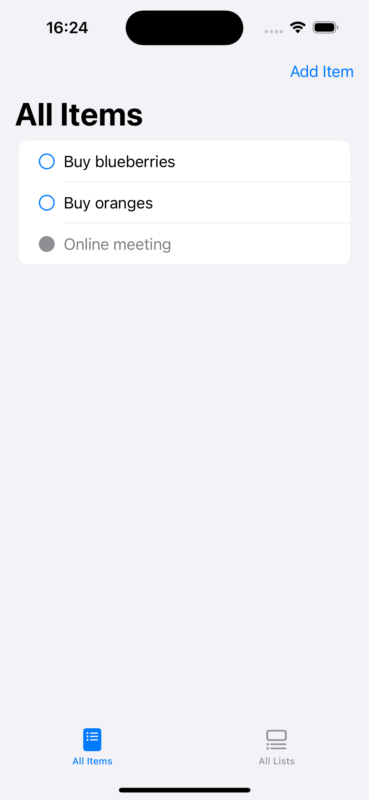
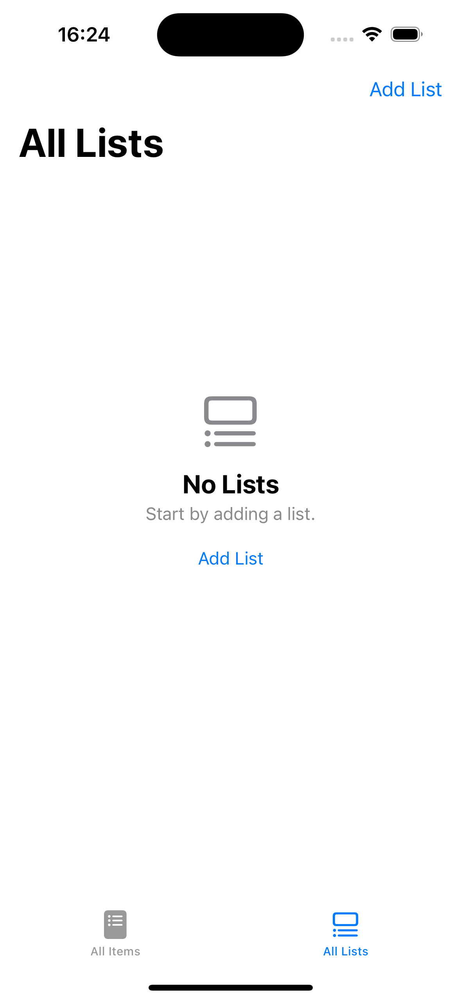
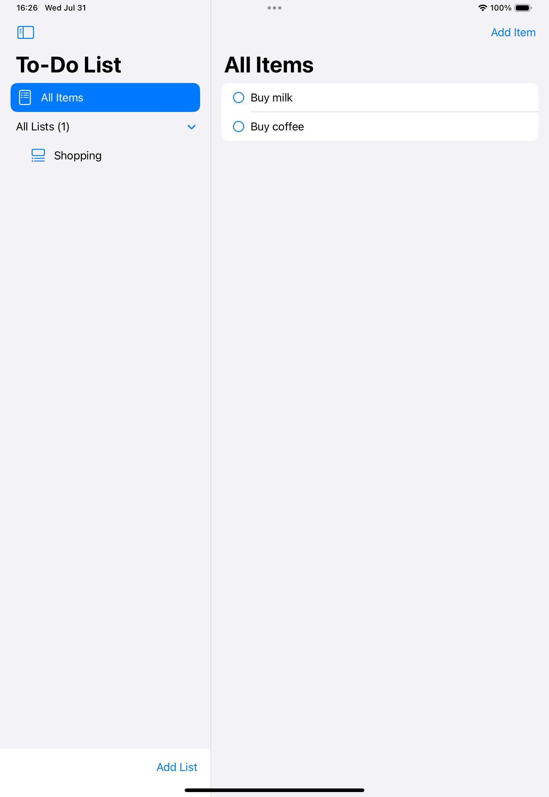
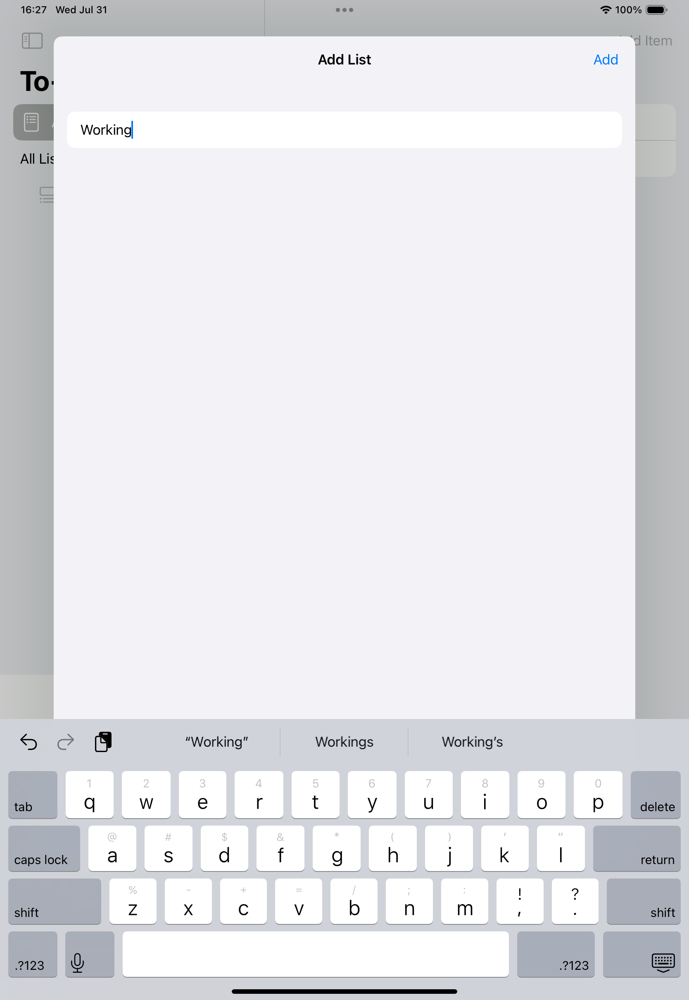
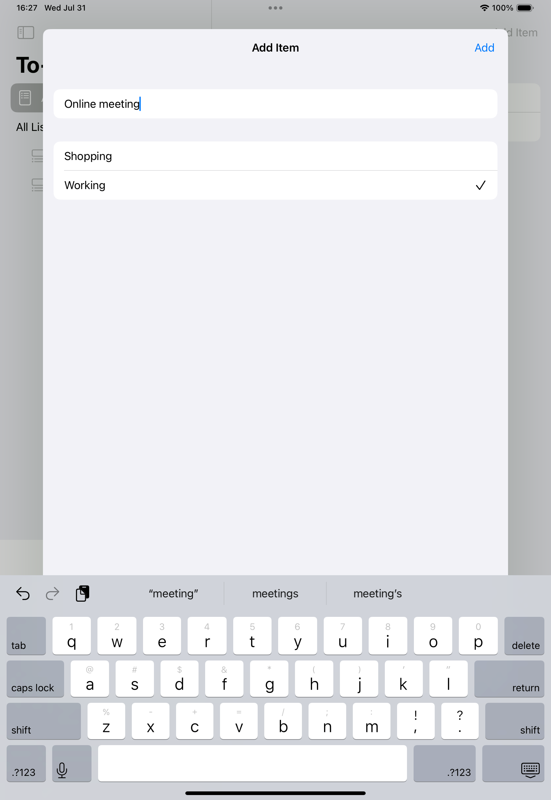
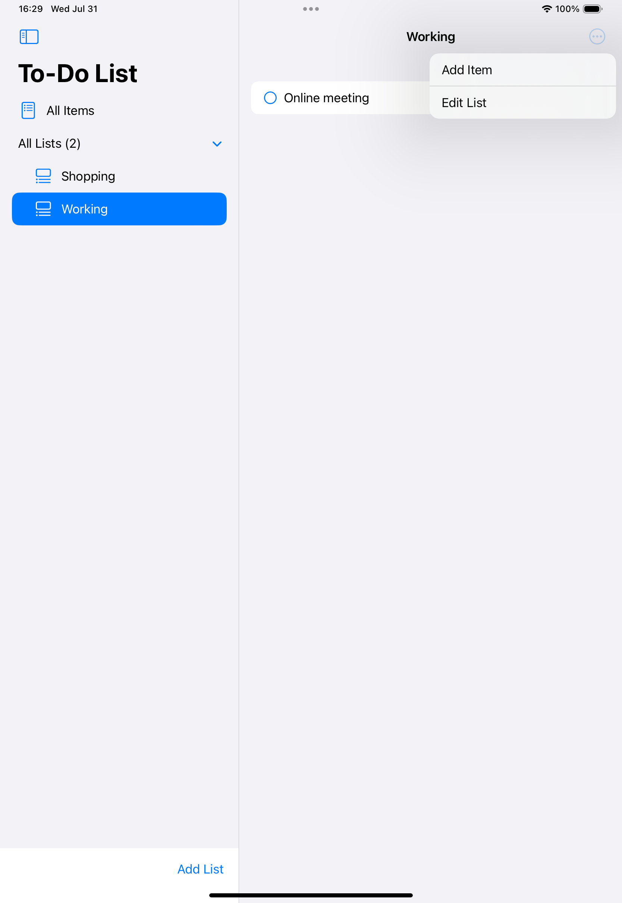

# iOS-SwiftUI-To-Do-List-App

This is an iOS to-do list app built with SwiftUI.

## Screenshots

Here are some screenshots of the app.

    
    
    
     
    
    
    

## Notice

This is for educational purposes only and should not be used for commercial purposes.

## License

This is licensed under the MIT license. See [LICENSE](./LICENSE) for more information.
